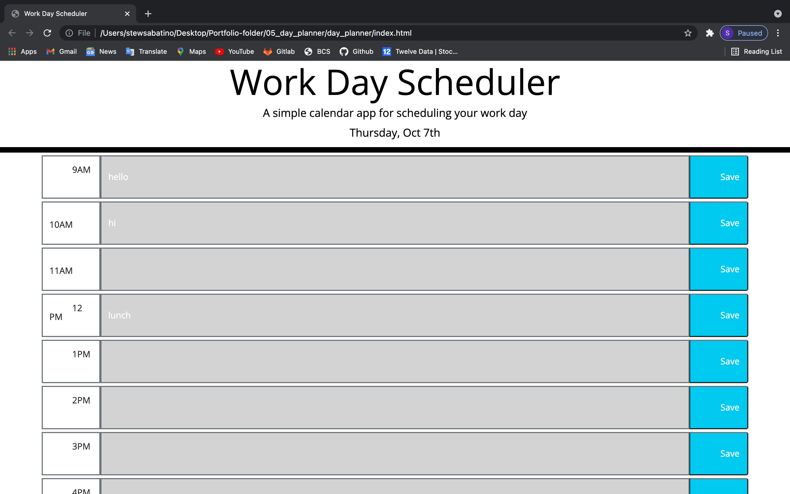

# day_planner
day planner for a single day
HTML - https://stewsabatino.github.io/day_planner/
Snippet - 

## Goals
* Use Bootstrap to set up the HTML elements to display the day planner
* Use Moment JS to show the day
* Set up a loop to color code each hour
* Save input data in individual hours to local storage
* Set up a loop to pull local storage and color code on page load
* Use JQuery as much as possible

### Bootstrap 
* I used Bootstrap to create rows and divs in the rows and wrapped them in a container
* Code 
```
<body>
    <!-- Jumbotron bootstrap element for display -->
    <header class="jumbotron">
      <h1 class="display-3">Work Day Scheduler</h1>
      <p class="lead">A simple calendar app for scheduling your work day</p>
      <p id="currentDay" class="lead"></p>
    </header>
    <!-- Container to hold all rows for hours -->
    <div class="container">
      <!-- rows to hold div(hour) input(planner input) button(save input) -->
      <!-- row class to have elements in a row, m1 is margin, id9 to loop -->
      <div class="row m-1" id="9">
        <!-- col-1 to hold 1/12 of row -->
        <div class="col-1 border border-2 border-secondary">
          9AM
        </div>
        <!-- input field and col-10 to hold 5/6 of row -->
        <input class="col-10 text-white border border-2 border-secondary">
        <!-- button to save input field -->
        <button class="col-1 bg-info rounded-end saveBtn">
          Save
        </button>
      </div>
```

#### Moment JS for day and current hour
* Day code 
```
// Grab id currentDay and make variable in JS
// Set var to the correct moment JS format 
var $headerDate = $("#currentDay")
$headerDate.text(moment().format("dddd, MMM Do"))
```
* Current hour code
```
var currentHour = parseInt(moment().format("H"))
```
##### Saving input content to local storage
```
// Saves inputs to local storage
$(".saveBtn").on("click", function(event) {
    event.preventDefault();
    var savedChar = $(this).siblings("input").val()
    localStorage.setItem($(this).parent().attr("id"), savedChar)
})

```
###### function for bringing local storage to page and color scheme
```
// creates loop function for local storage to load in and color scheme
function init(){
    // i is for row since ids start at 9 / j (can start at 0) is for color scheme
    for (var i = 9, j=0; i < 18; i++, j++) {
        var savedChar = localStorage.getItem(i)
        // selects row inputs by row id and pushes local storage info
        $("#" + i).children("input").val(savedChar)
        // vars for iteration row ids and parse them
        var rowIdString = array$rows[j].id
        var rowHour = parseInt(rowIdString)
        // if statement to set colors based on iteration
        if (rowHour) { 
            if (currentHour === rowHour) {    
                // selects rows id and the input child and sets new class
                $("#" + rowIdString).children("input").addClass("present")
            } else if (currentHour < rowHour) {
                $("#" + rowIdString).children("input").addClass("future")
            } else {
                $("#" + rowIdString).children("input").addClass("past")
            }
        }
    }
}
```